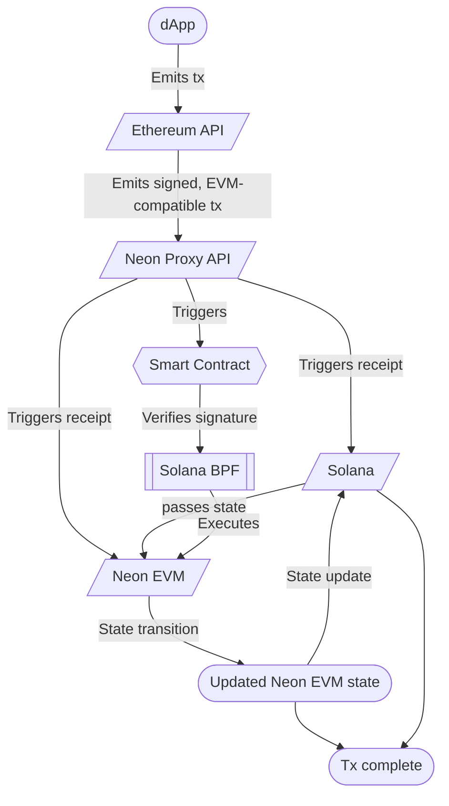

# Neon Labs

Temporary repo to work improvements on one page

## Pondering pictures

```mermaid

flowchart TD
    A([dApp]) -->|Emits tx|B
    B[/Ethereum API/] -->|Emits signed, EVM-compatible tx| C
    C[/Neon Proxy API/] --> |Triggers receipt| D
    C --> |Triggers receipt| E
    E(Neon EVM)-->|State transition| Z([Updated Neon EVM state])
    D[/Solana/]--> |passes state|E
    C -->|Triggers| F{{Smart Contract}}
    F -->|Verifies signature| G[[Solana BPF]]
    G --> |Executes|E[/Neon EVM/]
    Z --> |State update|D
    Z --> Y([Tx complete])
    D --> Y

```
