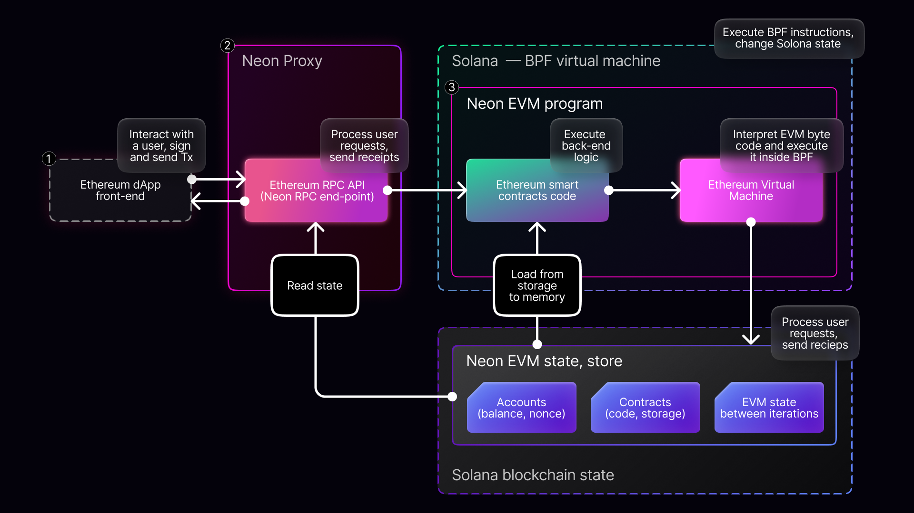

# How it works

This page provides a high-level overview of how Neon coordinates communication between Solana and Etherum dApps.

### Prerequisites

A basic understanding of:

- Blockchain transactions <!-- link user to educational center (specifically re state changes and finality) -->
- Ethereum-compatible wallets <!-- link user to educational center -- with onward links to the metamask integration how to -->
- API services <!-- link user to overview page for API services -->

## Neon transaction lifecycle

Effecting a user-initiated transaction (tx) from an Etherum dApp on Solana requires three main steps:

1. The user initiates a tx.
> The tx is a signed Ethereum-like tx sent using an Ethereum-compatible wallet.
2. This request is received by the Neon Proxy.
3. The Solana and Neon EVM chains undertake a state change.

As detailed in the image, the user's tx request initiates the following:

1. The Ethereum API passes the tx to the Neon Proxy via the [Neon API service](https://docs.neon-labs.org/docs/developing/connect_rpc).

2. The Neon Proxy processes the request, providing:

- Gas usage estimate for tx execution
- Smart contract initiation: wrapping the Ethereum-like tx as a Solana tx

3. The Neon Proxy passes the wrapped tx to Neon's smart contract hosted on Solana. This results in:
- A Solana receipt
- A corresponding Neon EVM receipt

3.1 The Neon smart contract then:

- Unwraps the tx and checks user signature
- Loads the Solana state, including account data and the smart contract's code, from Solana storage
- Executes the tx inside [Solana BPF](https://docs.solana.com/developing/runtime-facilities/programs#bpf-loader)
- Updates Solana's state to reflect the Neon EVM state <!-- missing logical link here as tx execution impact on Neon EVM not made clear -->
